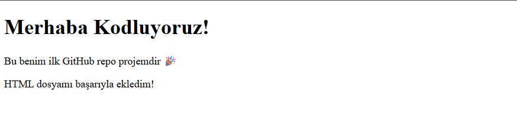

# Kodluyoruzilkrepo
Kodluyoruz Eğitimi kapsamında açtığım ilk repo

index.html:

# Kodluyoruz İlk Repo
Bu repo [Kodluyoruz](https://www.kodluyoruz.org) Front-End Eğitiminde oluşturduğumuz ilk repo. 
İçerisinde bir adet README dosyası, bir adet index.html barındırıyor.

## Installation
Öncelikle projeyi clonelayın.
```bash
git clone https://github.com/suataman/kodluyoruzilkrepo.git
```

# Usage

Projeyi cloneladıktan sonra Visual Studio kodu açın 

## Terminal

```bash
cd kodluyoruzilkrepo
code .
```

# Contributing

Pull requestler kabul edilir. Büyük değişiklikler için, lütfen önce neyi değiştirmek istediğinizi tartışmak üzere bir konu açınız.

# License
[MIT](https://choosealicense.com/licenses/mit/)
